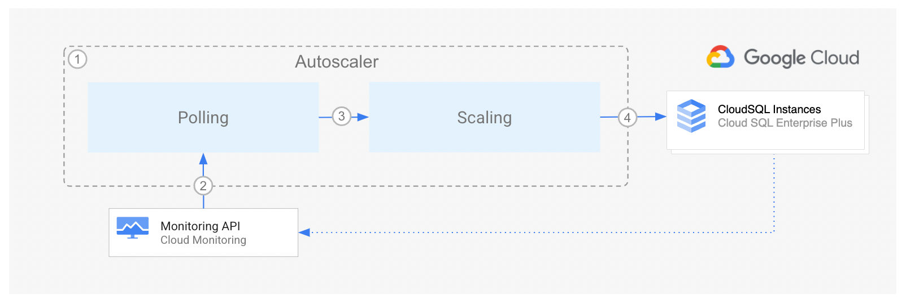

<br />
<p align="center">
  <h2 align="center">Autoscaler tool for CloudSQL</h2>
  <p align="center">
    An open source tool to autoscale CloudSQL Enterprise Plus instances
    <br />
    Home
    ·
    <a href="src/poller/README.md">Poller component</a>
    ·
    <a href="src/scaler/README.md">Scaler component</a>
    ·
    <a href="terraform/README.md">Terraform configuration</a>
    ·
    <a href="terraform/README.md#Monitoring">Monitoring</a>
  </p>
</p>

## Warning

This repository is not maintained and does not endorse the use of autoscaling mechanisms in a MySQL database. Use with caution.
Please read the CloudSQL documentation about its limitations https://cloud.google.com/sql/docs/mysql/.

## Notice

This product includes software developed at:
[Autoscaler tool for Cloud Spanner](https://github.com/cloudspannerecosystem/autoscaler/tree/main) Copyright Google

The original code was modified to autoscale CloudSQL Enterprise Plus editions. Limitations may apply.
Please read to the CloudSQL documentation about downtimes and intance scaling https://cloud.google.com/sql/docs/mysql/availability.

## Table of Contents

- [Warning](#warning)
- [Notice](#notice)
- [Table of Contents](#table-of-contents)
- [Overview](#overview)
- [Architecture](#architecture)
- [Deployment](#deployment)
- [Monitoring](#monitoring)
  - [Poller](#poller)
  - [Scaler](#scaler)
- [Configuration](#configuration)
- [Licensing](#licensing)

## Overview

The Autoscaler tool for CloudSQL is a companion tool to CloudSQL
that allows you to automatically increase or reduce the number of vCPUs
in one or more CloudSQL instances by changing the tier (machine type), based on their utilization.

When you create a [Cloud SQL instance][cloudsql-instance], you choose the
[machine-type][machine-type] that provide compute resources for the instance.
As the instance's workload changes, CloudSQL does _not_ automatically adjust
the compute capacity in the instance.

The Autoscaler monitors your instances and automatically updates or
downgrades the machine type to ensure that they stay within the
recommended CPU utilization plus or
minus an [allowed margin](src/poller/README.md#margins). Note that the
recommended thresholds are different depending if a CloudSQL instance is
[zonal or regional][cloudsql-locations].

## Architecture



The diagram above shows the high level components of the Autoscaler and the
interaction flow:

1.  The Autoscaler consists of two main decoupled components:

    - [The Poller component][autoscaler-poller]
    - [The Scaler component][autoscaler-scaler]

    These can be deployed to either [Cloud Run functions][cloud-functions], and configured so that the
    Autoscaler runs according to a user-defined schedule.

2.  At the specified time and frequency, the Poller component queries the
    [Cloud Monitoring][cloud-monitoring] API to retrieve the utilization metrics
    for each CloudSQL instance.

3.  For each instance, the Poller component pushes one message to the Scaler
    component. The payload contains the utilization metrics for the
    specific CloudSQL instance, and some of its corresponding configuration
    parameters.

4.  Using the chosen [scaling method](src/scaler/README.md#scaling-methods),
    the Scaler compares the CloudSQL instance metrics against the recommended
    thresholds, (plus or minus an [allowed margin](src/poller/README.md#margins)),
    and determines if the instance should be scaled, and the number of nodes or
    processing units that it should be scaled to. If the configured cooldown
    period has passed, then the Scaler component requests the CloudSQL Instance
    to scale out or in.

Throughout the flow, the Autoscaler writes a step by step summary
of its recommendations and actions to [Cloud Logging][cloud-logging] for
tracking and auditing.

## Deployment

To deploy the Autoscaler, decide which of the following strategies
is best adjusted to fulfill your technical and operational needs:

- [Deployment to Cloud Run functions](terraform/cloud-functions/README.md)

Google Cloud Platform resources are
deployed using Terraform. Please see the [Terraform instructions](terraform/README.md)
for more information on the deployment options available.

## Monitoring

The autoscaler publishes the following metrics to Cloud Monitoring which can be
used to monitor the behavior of the autoscaler, and to configure alerts.

### Poller

- Message processing counters:

  - `cloudsql/autoscaler/poller/requests-success` - the number
    of polling request messages recieved and processed successfully.
  - `cloudsql/autoscaler/poller/requests-failed` - the number
    of polling request messages which failed processing.

- CloudSQL Instance polling counters:
  - `cloudsql/autoscaler/poller/polling-success` - the number
    of successful polls of the CloudSQL instance metrics.
  - `cloudsql/autoscaler/poller/polling-failed` - the number of
    failed polls of the CloudSQL instance metrics.
  - Both of these metrics have `projectid` and `instanceid` to identify the
    CloudSQL instance.

### Scaler

- Message processing counters:
  - `cloudsql/autoscaler/scaler/requests-success` - the number
    of scaling request messages recieved and processed successfully.
  - `cloudsql/autoscaler/scaler/requests-failed` - the number
    of scaling request messages which failed processing.
- CloudSQL Instance scaling counters:

  - `cloudsql/autoscaler/scaler/scaling-success` - the number
    of succesful rescales of the CloudSQL instance.
  - `cloudsql/autoscaler/scaler/scaling-denied` - the number of
    CloudSQL instance rescale attempts that failed
  - `cloudsql/autoscaler/scaler/scaling-failed` - the number of
    CloudSQL instance rescale attempts that were denied by autoscaler
    configuration or policy.

  - These three metrics have the following attributes:
    - `cloudsql_project_id` - the Project ID of the affected CloudSQL
      instance
    - `cloudsql_instance_id` - the Instance ID of the affected CloudSQL
      instance
    - `scaling_method` - the scaling method used
    - `scaling_direction` - which can be `SCALE_UP`, `SCALE_DOWN` or
      `SCALE_SAME` (when the calculated rescale size is equal to the
      current size)
    - In addition, the `scaling-denied` counter has a `scaling_denied_reason`
      attribute containing the reason why the scaling was not performed, which
      can be:
      - `SAME_SIZE` - when the calculated rescale size is equal to the
        current instance size.
      - `MAX_SIZE` - when the instance has already been scaled up to the
        maximum configured size.
      - `WITHIN_COOLDOWN` - when the instance has been recently rescaled,
        and the autoscaler is waiting for the cooldown period to end.
      - `IN_PROGRESS` - when an instance scaling operation is still
        ongoing.

## Configuration

The parameters for configuring the Autoscaler are identical regardless of the chosen
deployment type, but the mechanism for configuration differs slightly:

- [Cloud Run functions](terraform/cloud-functions/README.md#configuration)

There is also a [browser-based configuration file editor and a command line
configuration file validator][configeditor].

## Licensing

```lang-none
Copyright 2020 Google LLC

Licensed under the Apache License, Version 2.0 (the "License");
you may not use this file except in compliance with the License.
You may obtain a copy of the License at

    https://www.apache.org/licenses/LICENSE-2.0

Unless required by applicable law or agreed to in writing, software
distributed under the License is distributed on an "AS IS" BASIS,
WITHOUT WARRANTIES OR CONDITIONS OF ANY KIND, either express or implied.
See the License for the specific language governing permissions and
limitations under the License.
```

<!-- LINKS: https://www.markdownguide.org/basic-syntax/#reference-style-links -->

[autoscaler-poller]: src/poller/README.md
[autoscaler-scaler]: src/scaler/README.md
[cloud-functions]: https://cloud.google.com/functions
[cloud-monitoring]: https://cloud.google.com/monitoring
[cloud-logging]: https://cloud.google.com/logging
[machine-type]: https://cloud.google.com/sql/docs/mysql/instance-settings
[code-of-conduct]: code-of-conduct.md
[configeditor]: configeditor/README.md
[contributing-guidelines]: contributing.md
[cloudsql-instance]: https://cloud.google.com/sql/docs/mysql/create-instance
[cloudsql-locations]: https://cloud.google.com/sql/docs/mysql/locations
