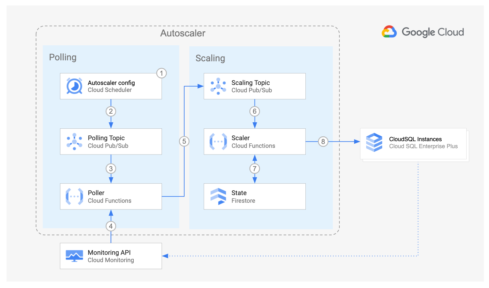

<br />
<p align="center">
  <p align="center">
    <!-- In one sentence: what does the code in this directory do? -->
    Set up the Autoscaler in Cloud Run functions in a per-project
    deployment using Terraform
    <br />
    <a href="../../../README.md">Home</a>
    ·
    <a href="../../../src/scaler/README.md">Scaler component</a>
    ·
    <a href="../../../src/poller/README.md">Poller component</a>
    ·
    Terraform configuration
    ·
    <a href="../README.md#Monitoring">Monitoring</a>
    <br />
    Cloud Run functions
    <br />
    Per-Project
    ·
    <a href="../centralized/README.md">Centralized</a>
    ·
    <a href="../distributed/README.md">Distributed</a>

  </p>

</p>

## Table of Contents

- [Table of Contents](#table-of-contents)
- [Overview](#overview)
- [Architecture](#architecture)
  - [Pros](#pros)
  - [Cons](#cons)
- [Before you begin](#before-you-begin)
- [Preparing the Autoscaler Project](#preparing-the-autoscaler-project)
- [Deploying the Autoscaler](#deploying-the-autoscaler)
- [Next steps](#next-steps)

## Overview

This directory contains Terraform configuration files to quickly set up the
infrastructure for your Autoscaler with a per-project deployment.

In this deployment option, all the components of the Autoscaler
reside in the same project as your CloudSQL instances.

This deployment is ideal for independent teams who want to self-manage the
infrastructure and configuration of their own Autoscalers. It is also a good
entry point for testing the Autoscaler capabilities.

## Architecture



For an explanation of the components of the Autoscaler and the
interaction flow, please read the
[main Architecture section](../README.md#architecture).

The per-project deployment has the following pros and cons:

### Pros

- **Design**: this option has the simplest design.
- **Configuration**: The control over scheduler parameters belongs to the team
  that owns the CloudSQL instance, therefore the team has the highest degree of
  freedom to adapt the Autoscaler to its needs.
- **Infrastructure**: This design establishes a clear boundary of
  responsibility and security over the Autoscaler infrastructure because the
  team owner of the CloudSQL instances is also the owner of the Autoscaler
  infrastructure.

### Cons

- **Maintenance**: with each team being responsible for the Autoscaler
  configuration and infrastructure it may become difficult to make sure that
  all Autoscalers across the company follow the same update guidelines.
- **Audit**: because of the high level of control by each team, a centralized
  audit may become more complex.

## Before you begin

In this section you prepare your project for deployment.

1.  Open the [Cloud Console][cloud-console]
2.  Activate [Cloud Shell][cloud-shell] \
    At the bottom of the Cloud Console, a
    <a href='https://cloud.google.com/shell/docs/features'>Cloud Shell</a>
    session starts and displays a command-line prompt. Cloud Shell is a shell
    environment with the Cloud SDK already installed, including the
    <code>gcloud</code> command-line tool, and with values already set for your
    current project. It can take a few seconds for the session to initialize.

3.  In Cloud Shell, clone this repository

4.  Export variables for the working directories

    ```sh
    export AUTOSCALER_DIR="$(pwd)/autoscaler/terraform/cloud-functions/per-project"
    ```

## Preparing the Autoscaler Project

In this section you prepare your project for deployment.

1.  Go to the [project selector page][project-selector] in the Cloud Console.
    Select or create a Cloud project.

2.  Make sure that billing is enabled for your Google Cloud project.
    [Learn how to confirm billing is enabled for your project][enable-billing].

3.  In Cloud Shell, set environment variables with the ID of your **autoscaler**
    project:

    ```sh
    export PROJECT_ID=<INSERT_YOUR_PROJECT_ID>
    gcloud config set project "${PROJECT_ID}"
    ```

4.  Enable the required Cloud APIs

    ```sh
    gcloud services enable \
      appengine.googleapis.com \
      cloudbuild.googleapis.com \
      cloudfunctions.googleapis.com \
      cloudresourcemanager.googleapis.com \
      cloudscheduler.googleapis.com \
      compute.googleapis.com \
      eventarc.googleapis.com \
      firestore.googleapis.com \
      iam.googleapis.com \
      logging.googleapis.com \
      monitoring.googleapis.com \
      pubsub.googleapis.com \
      run.googleapis.com \
      cloudsql.googleapis.com
    ```

## Deploying the Autoscaler

1.  Set the project ID and region in the corresponding Terraform
    environment variables

    ```sh
    export TF_VAR_project_id="${PROJECT_ID}"
    export TF_VAR_region="${REGION}"
    ```

2.  Set the name name of your CloudSQL instance in the following variable

    ```sh
    export TF_VAR_cloudsql_name=<INSERT_YOUR_CLOUDSQL_INSTANCE_NAME>
    ```

3.  Change directory into the Terraform per-project directory and initialize it.

    ```sh
    cd "${AUTOSCALER_DIR}"
    terraform init
    ```

4.  Create the Autoscaler infrastructure. Answer `yes` when prompted, after
    reviewing the resources that Terraform intends to create.

    ```sh
    terraform apply -parallelism=2
    ```

    If you are running this command in Cloud Shell and encounter errors of the form
    "`Error: cannot assign requested address`", this is a
    [known issue][provider-issue] in the Terraform Google provider, please retry
    the command above and include the flag `-parallelism=1`.

## Next steps

Your Autoscaler infrastructure is ready, follow the instructions in the main
page to [configure your Autoscaler](../README.md#configuration).

<!-- LINKS: https://www.markdownguide.org/basic-syntax/#reference-style-links -->

[project-selector]: https://console.cloud.google.com/projectselector2/home/dashboard
[enable-billing]: https://cloud.google.com/billing/docs/how-to/modify-project
[cloud-console]: https://console.cloud.google.com
[cloud-shell]: https://console.cloud.google.com/?cloudshell=true
